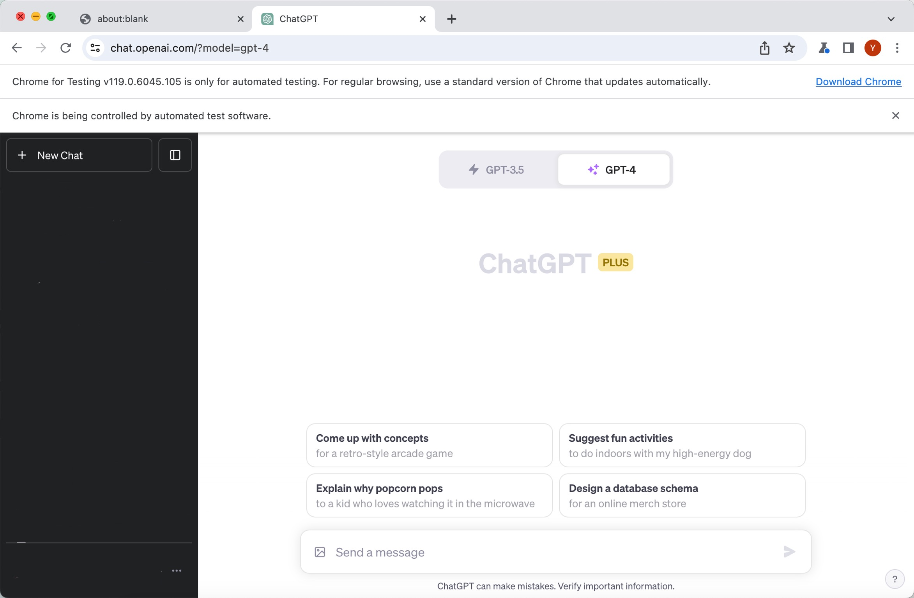

# GPT-4V-API
Self-hosted GPT-4V api. 
**Welcome any questions and suggestions. You may also PR to improve the code!**

> ⚠️ **Important Note:** As GPT-4V(ision) has not yet been made publicly available, this project necessitates an active ChatGPT Plus subscription for multimodal prompting access. It's worth noting that the tactics used by this project to tap into an unofficial GPT-4V API may contravene the associated ChatGPT Term of Service clause:
>> **2.** (c) **Restrictions:**  You may not ... (iv) except as permitted through the API, use any automated or programmatic method to extract data or output from the Services, including scraping, web harvesting, or web data extraction;

(warnings here are from https://github.com/ddupont808/GPT-4V-Act)

## Get started
Install dependencies
```bash
npm install .
```
Start the server (default at 3000)
```bash
node server.js
```

Note:
1. The basic logic of the api is to open a browser and interact with ChatGPT with vision on the webpage. Just like a human operator.
2. Headless = false by default. When you run it for the first time, you need to log in your ChatGPT account manually in the browser opened by puppeteer and make sure the page is on https://chat.openai.com like the image below. After log in for the first time, your browser user data will be stored at ./user_data and you can change the headless to "new" (https://developer.chrome.com/articles/new-headless/) to use the headless mode:
   
3. You may refer to test.py to see how to use the API

## Star History

[](https://star-history.com/#taogoddd/GPT-4V-API&Timeline)